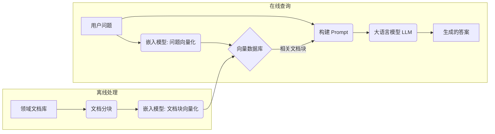

好的，我们进入**第六部分：应用与实践** 的 **第11章：实战项目：构建一个领域知识问答机器人**。这一章的目标是将前面所学的知识融会贯通，从零开始构建一个有实际用途的大模型应用。

---

**第11章：实战项目：构建一个领域知识问答机器人**

在前面的章节中，我们系统地学习了大模型的原理、训练、微调、对齐、评估以及各种典型应用场景。现在，是时候将这些知识整合起来，动手实践一个完整的项目了。本章将带领你一步步构建一个**领域知识问答机器人**。这个机器人的目标是能够根据你提供的特定领域的文档（例如，某个产品的说明书、公司的内部知识库、或者某个学科的教材），准确地回答用户基于这些文档提出的问题。

我们将采用目前处理这类任务最主流、最有效的技术方案之一：**检索增强生成 (Retrieval-Augmented Generation, RAG)**。我们在第 10.2 节已经初步介绍了 RAG 的概念，它通过结合**信息检索 (Information Retrieval)** 和**大语言模型生成 (Large Language Model Generation)** 的能力，使得模型能够基于最新的、特定的、非模型预训练知识库的内容来回答问题，有效缓解了通用大模型的知识局限性和幻觉问题。

通过这个实战项目，你将实践：

* 如何处理和准备领域文档数据。
* 如何选择和使用嵌入模型及向量数据库。
* 如何实现文档检索模块。
* 如何结合检索结果和原始问题构建有效的 Prompt。
* 如何调用大语言模型进行答案生成。
* （可选）如何构建简单的交互界面。
* 如何思考评估和优化这类 RAG 应用。

我们将使用 Python 作为主要编程语言，并借助一些流行的开源库（如 `transformers`, `sentence-transformers`, `datasets`, `faiss-cpu`/`chromadb`, 以及可选的 `langchain`/`llamaindex`）来简化开发流程。

**11.1 项目目标与设计思路**

**11.1.1 定义：构建一个能回答特定领域（如“深度学习基础”）问题的机器人**

我们的目标是创建一个问答系统，它能够：

1. **接收用户关于特定领域的问题:** 例如，用户可能会问“什么是反向传播？”、“Transformer 中的自注意力机制是如何工作的？”、“ReLU 激活函数有什么优缺点？”。这里的特定领域我们以本书前几章涉及的**“深度学习基础”**知识为例。
2. **基于提供的领域文档库进行回答:** 系统的回答应该主要依据我们提供给它的文档内容（例如，可以假设我们将本书的前几章内容作为文档库），而不是仅仅依赖大模型自身的预训练知识（尽管模型自身的知识可以帮助理解和组织语言）。
3. **生成准确、相关、流畅的答案:** 答案应该直接回答用户的问题，信息来源可靠（基于提供的文档），并且语言表达自然。

**11.1.2 技术选型：采用RAG（Retrieval-Augmented Generation）方案**

为什么选择 RAG？

* **解决知识局限性:** 通用 LLM 可能没有深入学习过非常特定或最新的领域知识。RAG 可以将相关的外部知识动态地注入到模型处理过程中。
* **减少幻觉:** 通过要求模型基于提供的上下文回答，可以显著降低模型“凭空捏造”答案的可能性。答案更具有可追溯性（可以知道是基于哪些文档片段生成的）。
* **知识更新方便:** 当领域知识更新时（例如，有了新的研究论文或产品手册更新），我们只需要更新文档库和向量索引，而不需要重新训练整个大语言模型。
* **结合检索与生成优势:** 利用了信息检索技术快速定位相关信息的能力，以及大语言模型强大的自然语言理解和生成能力。

**RAG 系统的核心流程（回顾）：**



我们将按照这个流程来逐步实现我们的问答机器人。

**11.2 数据准备**

RAG 系统的基础是高质量的领域文档库。

**11.2.1 收集领域文档（教科书章节、论文摘要、博客文章等）**

对于我们的“深度学习基础”问答机器人，数据来源可以是：

* **本书相关章节的文本内容:** 将前面章节的 Markdown 或纯文本导出。
* **经典的深度学习教科书:** 如《Deep Learning》（花书）的相关章节的公开版本（如果版权允许）。
* **重要的研究论文摘要或引言:** 如 Transformer、BERT、GPT 等论文。
* **高质量的技术博客文章:** 来自知名 AI 研究者或机构的博客。
* **在线课程的讲义:** 如 Stanford CS224n (NLP), CS231n (CV) 的部分公开讲义。

**数据格式:**

最好将收集到的文档整理成统一的格式，例如：

* **纯文本文件 (.txt):** 每个文件包含一篇完整的文档或一个章节。
* **Markdown 文件 (.md):** 保留一些基本的格式信息。
* **JSON Lines (.jsonl):** 每行一个 JSON 对象，包含文档内容和元数据（如来源、标题、章节等）。例如：
  ```json
  {"source": "Book Chapter 3", "title": "Transformer Architecture", "text": "Transformer 的核心是自注意力机制..."}
  {"source": "Blog Post", "title": "Understanding ReLU", "text": "ReLU 激活函数定义为..."}
  ```

**在本示例中，我们假设已经将本书前几章的内容保存为多个 `.txt` 文件，放在一个名为 `knowledge_base` 的目录下。**

**11.2.2 文档切块（Chunking）策略**

直接将整篇长文档计算嵌入并用于检索通常效果不佳，原因如下：

* **嵌入模型的上下文限制:** 大多数嵌入模型（尤其是 Sentence Transformers）在处理非常长的文本时效果会下降，它们通常针对句子或段落级别的语义进行优化。
* **检索精度:** 长文档的嵌入可能包含太多主题，导致与具体问题的相关性被稀释。检索到整个长文档后，LLM 可能难以从中找到回答问题的关键信息。
* **LLM 上下文窗口限制:** 将非常长的文档片段放入 LLM 的 Prompt 可能会超出其上下文窗口大小。

因此，需要将长文档切分成更小的、语义相对完整的**块 (Chunks)**。选择合适的切块策略对 RAG 性能至关重要。

**常用切块策略:**

1. **固定长度切块 (Fixed Size Chunking):**
   * 按固定数量的 Token（例如 256, 512）或字符进行切分。
   * **优点:** 实现简单。
   * **缺点:** 可能在句子或段落中间断开，破坏语义完整性。
2. **基于分隔符切块 (Separator-based Chunking):**
   * 使用特定的分隔符（如换行符 `\n\n`, 段落标记, 标题标记）进行切分。
   * **优点:** 能更好地保持语义单元（如段落）的完整性。
   * **缺点:** 块的大小可能不均匀。
3. **递归字符切块 (Recursive Character Text Splitting):** (常见于 LangChain/LlamaIndex)
   * 尝试按一组给定的分隔符（如 `["\n\n", "\n", " ", ""]`）递归地切分文本，直到块的大小满足要求。优先使用靠前的分隔符（通常是语义更强的分隔符）。
   * **优点:** 试图在保持语义的同时控制块的大小。
4. **考虑句子边界:** 结合句子分割工具（如 `nltk.sent_tokenize`），确保切块尽可能在句子末尾进行。
5. **重叠切块 (Overlapping Chunks):** 在相邻的块之间设置一定的重叠（Overlap），例如重叠 50 个 Token。
   * **优点:** 可以减少信息在块边界被切割丢失的风险。如果一个关键信息正好在边界处，重叠可以确保它至少完整地出现在一个块中。
   * **缺点:** 增加了存储和计算的冗余。

**选择策略的考量:**

* **嵌入模型的最佳输入长度:** 参考所选嵌入模型的文档。
* **LLM 的上下文窗口大小:** 确保最终放入 Prompt 的检索到的块总长度加上问题和其他提示内容不超过 LLM 限制。
* **内容的结构:** 如果文档有清晰的段落或章节结构，优先使用基于分隔符的方法。
* **实验:** 通常需要尝试不同的块大小 (Chunk Size) 和重叠大小 (Chunk Overlap) 来找到最佳效果。

**代码示例：使用 LangChain 或 LlamaIndex 进行文档加载与切块 (概念性)**

LangChain 和 LlamaIndex 是两个流行的用于构建 LLM 应用（特别是 RAG）的框架，它们提供了方便的文档加载器 (Document Loaders) 和文本分割器 (Text Splitters)。

```python
import os
# --- 使用 LangChain ---
from langchain.document_loaders import DirectoryLoader, TextLoader
from langchain.text_splitter import RecursiveCharacterTextSplitter

# --- 或者使用 LlamaIndex ---
# from llama_index.core import SimpleDirectoryReader
# from llama_index.core.node_parser import SentenceSplitter # LlamaIndex 的分割器有不同名称

# 定义文档库路径
knowledge_base_dir = "./knowledge_base" # 假设 txt 文件在此目录下

# --- LangChain 示例 ---
print("Loading documents using LangChain...")
# 使用 DirectoryLoader 加载目录下所有 txt 文件
loader = DirectoryLoader(knowledge_base_dir, glob="**/*.txt", loader_cls=TextLoader, show_progress=True)
documents = loader.load() # 返回 Document 对象列表，包含 content 和 metadata
print(f"Loaded {len(documents)} documents.")

print("\nSplitting documents into chunks using LangChain...")
# 使用递归字符分割器
text_splitter = RecursiveCharacterTextSplitter(
    chunk_size=512,     # 每个块的目标大小 (token 数或字符数，取决于 splitter 实现)
    chunk_overlap=50,     # 相邻块的重叠大小
    length_function=len, # 使用字符长度计算 chunk_size
    add_start_index=True, # 在 metadata 中添加块在原文的起始位置
)
chunks = text_splitter.split_documents(documents)
print(f"Split into {len(chunks)} chunks.")

# 查看第一个块的内容和元数据 (示例)
if chunks:
    print("\nExample Chunk (LangChain):")
    print("Content:", chunks[0].page_content[:200] + "...") # 显示前 200 个字符
    print("Metadata:", chunks[0].metadata)
    # Metadata 可能包含: {'source': 'knowledge_base/chapter1.txt', 'start_index': 0}


# --- LlamaIndex 示例 (类似逻辑) ---
# print("\nLoading and splitting documents using LlamaIndex...")
# reader = SimpleDirectoryReader(knowledge_base_dir, required_exts=[".txt"])
# documents_li = reader.load_data()
# splitter = SentenceSplitter(chunk_size=512, chunk_overlap=50) # 举例
# nodes = splitter.get_nodes_from_documents(documents_li) # LlamaIndex 中称为 Node
# print(f"Split into {len(nodes)} nodes (chunks).")
# if nodes:
#     print("\nExample Node (LlamaIndex):")
#     print("Content:", nodes[0].get_content()[:200] + "...")
#     print("Metadata:", nodes[0].metadata)

# 注意：LangChain 和 LlamaIndex 的具体 API 和对象名称可能随版本变化。
# 它们提供了多种 Loader 和 Splitter 选项。
# 如果不使用这些框架，也可以手动实现读取文件和按规则切分文本的逻辑。
```

切分后，我们就得到了一系列的文本块 (Chunks)，每个块都准备好被转换成向量嵌入。

**11.3 向量数据库与索引构建**

接下来，我们需要将这些文本块转换为向量，并将它们存储在一个能够进行高效相似度搜索的系统中——向量数据库。

**11.3.1 选择嵌入模型（如Sentence Transformers）**

选择一个好的嵌入模型对于检索质量至关重要。需要考虑：

* **性能:** 模型在语义相似度任务上的表现如何？是否在相关领域的数据上预训练过？
* **速度:** 嵌入计算的速度。
* **维度:** 嵌入向量的维度（影响存储和相似度计算速度）。
* **语言:** 是否支持目标语言（我们的例子是中文，需要选择支持中文的或多语言的模型）。
* **对称 vs. 非对称任务:**
  * **对称:** 两个输入（如两个句子）的语义相似度判断。适用于文本聚类、相似文本推荐。
  * **非对称:** 一个短查询（问题）和一个长文档（答案片段）的语义相关性判断。适用于信息检索、问答。
  * 对于 RAG，通常是**非对称**任务（问题 vs. 文档块），选择为这类任务优化的模型可能效果更好（如 `multi-qa-mpnet-base-dot-v1` 用于英文问答，或一些多语言问答模型）。

**常用选择 (支持中文或多语言的 Sentence Transformers 模型):**

* `paraphrase-multilingual-MiniLM-L12-v2`: 多语言，速度快，通用性好。
* `paraphrase-multilingual-mpnet-base-v2`: 多语言，效果通常比 MiniLM 好，但稍慢。
* `distiluse-base-multilingual-cased-v1/v2`: 基于 Google USE 的多语言模型。
* 一些专门为中文优化的模型（可以在 Hugging Face Hub 搜索 "chinese sentence embedding"）。

**在本示例中，我们选择 `paraphrase-multilingual-mpnet-base-v2` 作为嵌入模型。**

```python
from sentence_transformers import SentenceTransformer

embedding_model_name = 'paraphrase-multilingual-mpnet-base-v2'
print(f"\nLoading embedding model: {embedding_model_name}...")
embedding_model = SentenceTransformer(embedding_model_name, device=device) # 加载到 GPU (如果可用)
print("Embedding model loaded.")
```

**11.3.2 选择向量数据库（FAISS, ChromaDB, Pinecone等）**

向量数据库专门用于存储和高效检索高维向量。

* **选择考量:**
  * **性能:** 索引构建速度、查询速度（召回率 vs. 延迟）。
  * **可扩展性:** 能否处理大规模数据和高并发查询。
  * **存储方式:** 内存数据库 (FAISS)、磁盘数据库 (ChromaDB)、云服务 (Pinecone, Milvus Cloud)。
  * **易用性:** API 是否友好，社区支持如何。
  * **成本:** 开源 vs. 商业服务。
* **常用选择:**
  * **FAISS (Facebook AI Similarity Search):** 一个高效的向量相似度搜索库，支持多种索引类型（如 `IndexFlatL2`, `IndexIVFFlat`, `IndexHNSWFlat`），主要在内存中运行（也可以与磁盘结合），非常适合中等规模应用和快速原型验证。`faiss-cpu` (CPU版) 和 `faiss-gpu` (GPU版) 均可用。
  * **ChromaDB:** 开源的、面向 AI 应用的嵌入数据库，提供 Pythonic API，支持磁盘存储，易于本地部署和使用。
  * **Milvus / Weaviate / Qdrant:** 开源的、功能更全面的向量数据库系统，支持分布式部署、多种索引、标量过滤等高级功能。
  * **Pinecone / Google Vertex AI Matching Engine / AWS OpenSearch (k-NN):** 托管的云向量数据库服务，提供高可用性和可扩展性，但有使用成本。

**在本示例中，为了简单和本地运行，我们选择使用 `FAISS` (CPU 版本 `faiss-cpu`)。** (如果数据量很大或追求更高性能，可以考虑其他选项)。

**11.3.3 生成文档块嵌入并存入数据库**

现在我们将之前切分好的文本块，使用加载的嵌入模型计算它们的向量，并使用 FAISS 构建索引。

```python
import faiss # 需要安装 faiss-cpu 或 faiss-gpu
import numpy as np

# 假设 chunks 是之前 LangChain 或手动切分得到的 Document 对象列表
# 需要提取纯文本内容
chunk_texts = [chunk.page_content for chunk in chunks]

print(f"\nGenerating embeddings for {len(chunk_texts)} chunks...")
# 使用 embedding_model 批量计算嵌入 (速度更快)
# encode 方法可以接受文本列表
chunk_embeddings = embedding_model.encode(chunk_texts, batch_size=64, show_progress_bar=True, convert_to_numpy=True)
# convert_to_numpy=True 直接获取 NumPy 数组，FAISS 需要 NumPy

print("Embeddings generated. Shape:", chunk_embeddings.shape) # (num_chunks, embedding_dim)

# 获取嵌入维度
d = chunk_embeddings.shape[1]

# 11.3.4 构建 FAISS 索引
print("\nBuilding FAISS index...")
# 使用 IndexFlatL2: 这是最简单的索引，进行精确的 L2 距离 (或等价于余弦相似度，如果向量已归一化) 搜索。
# 对于非常大的数据集，可能需要更复杂的索引如 IndexIVFFlat 或 IndexHNSWFlat 来加速搜索，但会牺牲一些精度。
index = faiss.IndexFlatL2(d)

# (可选) 如果想使用余弦相似度，可以先对嵌入进行 L2 归一化
# faiss.normalize_L2(chunk_embeddings)
# index = faiss.IndexFlatIP(d) # IndexFlatIP 用于内积，归一化后内积等价于余弦相似度

# 将嵌入添加到索引中
index.add(chunk_embeddings.astype('float32')) # FAISS 通常需要 float32

print(f"FAISS index built. Index size: {index.ntotal} vectors.")

# --- 保存索引和对应的文本块 ---
# 实际应用中需要将索引持久化，并将索引中的向量 ID 与原始文本块关联起来
# 保存 FAISS 索引
faiss.write_index(index, "my_faiss.index")

# 保存文本块 (例如使用 pickle 或 JSON)
import pickle
with open("chunks_data.pkl", "wb") as f:
    # 保存原始文本块列表，以便根据检索到的索引 ID 找到原文
    pickle.dump(chunk_texts, f)

print("FAISS index and chunk texts saved.")

# --- 加载索引和数据 (下次使用时) ---
# index = faiss.read_index("my_faiss.index")
# with open("chunks_data.pkl", "rb") as f:
#     chunk_texts = pickle.load(f)
```

现在，我们已经有了一个包含领域知识向量的 FAISS 索引，以及与之对应的原始文本块列表。

**11.4 检索模块实现**

当用户提出问题时，我们需要实现检索模块来找到最相关的文档块。

**11.4.1 将用户问题转换为嵌入**

使用与构建索引时**相同**的嵌入模型来计算用户问题的向量表示。

**11.4.2 在向量数据库中进行相似度检索，获取相关文档块**

使用 FAISS 索引的 `search` 方法来查找与问题向量最相似的 K 个向量。

```python
def retrieve_relevant_chunks(query, embedding_model, index, chunk_texts_list, top_k=3):
    """
    根据用户查询检索最相关的文本块

    Args:
        query (str): 用户的查询语句
        embedding_model: 加载的 Sentence Transformer 模型
        index: 加载的 FAISS 索引
        chunk_texts_list (list): 与索引向量对应的原始文本块列表
        top_k (int): 返回最相关的 top_k 个块

    Returns:
        list: 包含 top_k 个最相关文本块内容的列表
    """
    print(f"\nRetrieving relevant chunks for query: '{query}'")
    # 1. 将查询转换为嵌入向量
    query_embedding = embedding_model.encode([query], convert_to_numpy=True).astype('float32')
    # (可选) 如果索引是基于归一化向量和 IndexFlatIP，这里也要归一化查询向量
    # faiss.normalize_L2(query_embedding)

    # 2. 在 FAISS 索引中搜索最相似的 top_k 个向量
    # index.search 返回两个数组: D (distances) 和 I (indices)
    distances, indices = index.search(query_embedding, top_k)

    # 3. 根据检索到的索引获取对应的文本块
    relevant_chunks = [chunk_texts_list[i] for i in indices[0]] # indices[0] 是第一个查询结果的索引列表

    print(f"Retrieved {len(relevant_chunks)} chunks.")
    # print("Distances:", distances[0])
    # print("Indices:", indices[0])
    # print("Example relevant chunk:", relevant_chunks[0][:100] + "...")

    return relevant_chunks

# --- 示例用法 ---
user_query = "Transformer中的多头注意力机制是什么？"
# 加载之前保存的索引和数据
index_loaded = faiss.read_index("my_faiss.index")
with open("chunks_data.pkl", "rb") as f:
    chunk_texts_loaded = pickle.load(f)

# 执行检索
retrieved_docs = retrieve_relevant_chunks(user_query, embedding_model, index_loaded, chunk_texts_loaded, top_k=3)

print("\n--- Retrieved Documents ---")
for i, doc in enumerate(retrieved_docs):
    print(f"--- Doc {i+1} ---")
    print(doc[:300] + "...") # 打印部分内容
    print("-" * 20)
```

检索模块现在可以根据用户问题返回最相关的几个文档片段了。

**11.5 生成模块实现**

最后一步是将检索到的信息和用户问题结合起来，让大语言模型生成最终的答案。

**11.5.1 选择一个基础大语言模型（可通过API或本地加载）**

我们需要一个强大的生成式 LLM 来理解上下文并生成流畅的答案。

* **选择:**
  * **API:** 使用 OpenAI (GPT-3.5/4), Anthropic (Claude), Google (Gemini) 等提供的 API。简单方便，模型能力强，但有成本且依赖网络。
  * **本地开源模型:** 加载 Hugging Face Hub 上的开源 LLM（如 Llama 2/3, Mixtral, Gemma 等）。需要足够的本地计算资源（特别是 GPU 显存），但更灵活，数据隐私性更好。模型的选择取决于资源和性能需求。
* **在本示例中，为了能在本地运行（假设有足够显存，例如 >16GB），我们尝试使用一个中等规模的开源模型，例如 `mistralai/Mistral-7B-Instruct-v0.2` 或类似模型。如果资源不足，可以考虑更小的模型或使用 API。**

```python
from transformers import AutoTokenizer, AutoModelForCausalLM

# --- 使用本地开源模型 (需要足够显存) ---
llm_model_name = "mistralai/Mistral-7B-Instruct-v0.2" # 示例，可以选择其他适合的模型
print(f"\nLoading LLM for generation: {llm_model_name}...")
llm_tokenizer = AutoTokenizer.from_pretrained(llm_model_name)
# 如果 tokenizer 没有 pad token，需要设置
if llm_tokenizer.pad_token is None:
    llm_tokenizer.pad_token = llm_tokenizer.eos_token
    llm_tokenizer.pad_token_id = llm_tokenizer.eos_token_id

llm_model = AutoModelForCausalLM.from_pretrained(
    llm_model_name,
    torch_dtype=torch.float16, # 使用 float16 节省显存
    device_map="auto" # 自动将模型分片到可用 GPU (如果需要)
)
print("LLM loaded.")

# --- 或者使用 API (概念性) ---
# import openai
# openai.api_key = "YOUR_API_KEY"
# def call_openai_llm(prompt):
#     response = openai.chat.completions.create(
#         model="gpt-3.5-turbo", # or "gpt-4"
#         messages=[{"role": "user", "content": prompt}],
#         max_tokens=200,
#         temperature=0.7,
#     )
#     return response.choices[0].message.content
```

**11.5.2 构建包含用户问题和检索到上下文的Prompt**

这是 RAG 的关键一步，需要设计一个好的 Prompt 模板，将检索到的文档块 (Context) 和原始问题 (Question) 组合起来，清晰地指示 LLM 基于上下文回答问题。

**Prompt 模板示例:**

```text
请根据下面提供的上下文信息来回答问题。
如果你在上下文中找不到答案，请说你不知道，不要试图编造答案。
确保你的回答简洁且直接针对问题。

上下文：
---
{context}
---

问题：{question}

答案：
```

其中 `{context}` 将被替换为拼接起来的相关文档块，`{question}` 将被替换为用户问题。

**处理多个文档块:**

可以将检索到的 `top_k` 个文档块简单地拼接在一起作为上下文。

```python
def build_rag_prompt(question, context_chunks):
    """构建 RAG 的 Prompt"""
    context = "\n\n---\n\n".join(context_chunks) # 将块用分隔符连接

    prompt_template = """
请根据下面提供的上下文信息来回答问题。
如果你在上下文中找不到答案，请说你不知道，不要试图编造答案。
确保你的回答简洁且直接针对问题。

上下文：
---
{context}
---

问题：{question}

答案：
"""
    prompt = prompt_template.format(context=context, question=question)
    return prompt

# 构建 Prompt
rag_prompt = build_rag_prompt(user_query, retrieved_docs)
print("\n--- Generated RAG Prompt ---")
print(rag_prompt)
```

**11.5.3 调用大模型生成答案**

将构建好的 Prompt 输入给选择的 LLM 进行生成。

```python
def generate_answer(prompt, model, tokenizer, max_new_tokens=150):
    """使用 LLM 生成答案"""
    print("\nGenerating answer using LLM...")
    # 对 Prompt 进行编码
    inputs = tokenizer(prompt, return_tensors="pt", return_attention_mask=False).to(model.device) # 注意移到模型所在设备

    # 设置生成参数
    generate_kwargs = {
        "max_new_tokens": max_new_tokens,
        "temperature": 0.7,
        "top_p": 0.95,
        "do_sample": True,
        "pad_token_id": tokenizer.pad_token_id,
    }

    # 生成答案
    with torch.no_grad():
        outputs = model.generate(**inputs, **generate_kwargs)

    # 解码生成的 token (只解码新生成的部分)
    input_length = inputs["input_ids"].shape[1]
    generated_tokens = outputs[0, input_length:]
    answer = tokenizer.decode(generated_tokens, skip_special_tokens=True)

    return answer.strip()

# --- 使用本地模型生成 ---
final_answer = generate_answer(rag_prompt, llm_model, llm_tokenizer)
print("\n--- Final Answer ---")
print(final_answer)

# --- 使用 API 生成 (概念性) ---
# final_answer_api = call_openai_llm(rag_prompt)
# print("\n--- Final Answer (API) ---")
# print(final_answer_api)
```

现在，我们就完成了一个基本的 RAG 问答流程！

**11.6 构建简单交互界面（可选）**

为了方便使用，我们可以使用 Streamlit 或 Gradio 库为我们的问答机器人创建一个简单的 Web 交互界面。

**代码示例：使用 Streamlit 创建 Web 界面**

```python
# rag_app.py
import streamlit as st
from sentence_transformers import SentenceTransformer
import faiss
import pickle
from transformers import AutoTokenizer, AutoModelForCausalLM
import torch

# --- 把之前的函数和模型加载封装起来 ---

@st.cache_resource # 使用 Streamlit 缓存加载的模型和索引
def load_resources():
    print("Loading resources...")
    # 加载嵌入模型
    embedding_model = SentenceTransformer('paraphrase-multilingual-mpnet-base-v2', device="cuda" if torch.cuda.is_available() else "cpu")
    # 加载 FAISS 索引和文本块
    index = faiss.read_index("my_faiss.index")
    with open("chunks_data.pkl", "rb") as f:
        chunk_texts = pickle.load(f)
    # 加载 LLM 和 Tokenizer
    llm_model_name = "mistralai/Mistral-7B-Instruct-v0.2" # 或者你选择的模型
    llm_tokenizer = AutoTokenizer.from_pretrained(llm_model_name)
    if llm_tokenizer.pad_token is None:
        llm_tokenizer.pad_token = llm_tokenizer.eos_token
        llm_tokenizer.pad_token_id = llm_tokenizer.eos_token_id
    llm_model = AutoModelForCausalLM.from_pretrained(
        llm_model_name,
        torch_dtype=torch.float16,
        device_map="auto"
    )
    print("Resources loaded.")
    return embedding_model, index, chunk_texts, llm_tokenizer, llm_model

# (包含之前的 retrieve_relevant_chunks, build_rag_prompt, generate_answer 函数)
def retrieve_relevant_chunks(query, embedding_model, index, chunk_texts_list, top_k=3):
    # ... (省略实现，同上)
    query_embedding = embedding_model.encode([query], convert_to_numpy=True).astype('float32')
    distances, indices = index.search(query_embedding, top_k)
    relevant_chunks = [chunk_texts_list[i] for i in indices[0]]
    return relevant_chunks

def build_rag_prompt(question, context_chunks):
    # ... (省略实现，同上)
    context = "\n\n---\n\n".join(context_chunks)
    prompt_template = """...""" # 同上
    prompt = prompt_template.format(context=context, question=question)
    return prompt

def generate_answer(prompt, model, tokenizer, max_new_tokens=150):
    # ... (省略实现，同上)
    inputs = tokenizer(prompt, return_tensors="pt", return_attention_mask=False).to(model.device)
    generate_kwargs = {...} # 同上
    with torch.no_grad():
        outputs = model.generate(**inputs, **generate_kwargs)
    input_length = inputs["input_ids"].shape[1]
    generated_tokens = outputs[0, input_length:]
    answer = tokenizer.decode(generated_tokens, skip_special_tokens=True)
    return answer.strip()


# --- Streamlit 应用主体 ---
st.title("深度学习基础知识问答机器人 (RAG Demo)")
st.write("输入你关于深度学习基础知识的问题，机器人将尝试基于提供的文档库进行回答。")

# 加载资源 (会被缓存)
embedding_model, index, chunk_texts, llm_tokenizer, llm_model = load_resources()

# 获取用户输入
user_query = st.text_input("请输入你的问题：")

if user_query:
    st.write("正在处理，请稍候...")

    # 1. 检索
    with st.spinner("正在检索相关文档..."):
        relevant_chunks = retrieve_relevant_chunks(user_query, embedding_model, index, chunk_texts, top_k=3)

    if not relevant_chunks:
        st.warning("未能找到相关文档。")
    else:
        # 显示检索到的部分上下文 (可选)
        with st.expander("查看检索到的上下文"):
            for i, chunk in enumerate(relevant_chunks):
                st.write(f"**块 {i+1}:**")
                st.caption(chunk[:500] + "...") # 显示部分

        # 2. 构建 Prompt
        rag_prompt = build_rag_prompt(user_query, relevant_chunks)

        # 3. 生成答案
        with st.spinner("正在生成答案..."):
            final_answer = generate_answer(rag_prompt, llm_model, llm_tokenizer)

        # 显示答案
        st.subheader("回答：")
        st.write(final_answer)

# --- 如何运行 ---
# 1. 将上述代码保存为 rag_app.py
# 2. 确保 my_faiss.index 和 chunks_data.pkl 文件在同一目录下
# 3. 安装 streamlit: pip install streamlit
# 4. 在终端运行: streamlit run rag_app.py
# 5. 在浏览器中打开显示的 URL
```

这个 Streamlit 应用提供了一个简单的界面，用户可以输入问题，然后看到检索到的上下文（可选）和最终生成的答案。

**11.7 评估与优化**

我们构建的 RAG 系统只是一个起点，其性能还有很大的提升空间。评估和优化是迭代改进的关键。

**11.7.1 评估检索准确率与生成答案质量**

评估 RAG 系统需要分别评估**检索模块**和**生成模块**，以及**端到端的问答效果**。

* **检索评估:**

  * **指标:**
    * **Hit Rate:** 检索到的 Top-K 文档中，有多少比例包含了正确答案所在的“黄金”文档块？（需要预先标注好每个问题的答案来源）
    * **MRR (Mean Reciprocal Rank):** 黄金文档块在检索结果中排名的倒数的平均值。排名越高越好。
    * **Precision@K / Recall@K:** 检索到的 Top-K 文档中有多少是相关的 / 所有相关文档中有多少被检索到了 Top-K？（需要相关性标注）
  * **方法:** 构建一个包含 (问题, 黄金文档块ID/内容) 的测试集，运行检索模块，计算上述指标。
* **生成评估:**

  * **指标 (给定理想上下文):**
    * **ROUGE / BLEU:** 将模型在**理想上下文**（假设检索到了完全正确的文档块）下生成的答案与人工编写的参考答案进行比较。（局限性见 9.2.2）
    * **人工评估 (Faithfulness / Relevance):** 人工判断模型生成的答案是否**忠实于**给定的上下文 (Faithfulness)，以及是否**相关于**原始问题 (Relevance)。
  * **方法:** 准备 (问题, 理想上下文, 参考答案) 测试集，让模型生成答案，然后进行自动化或人工评估。
* **端到端评估:**

  * **指标:**
    * **答案正确性 (Answer Correctness):** 由人工判断最终生成的答案是否正确回答了问题。
    * **答案相关性 (Answer Relevance):** 答案是否直接回答了问题。
    * **无害性/流畅性等:** 参考 9.1 节的其他维度。
  * **方法:** 构建 (问题, 参考答案) 测试集，运行完整的 RAG 系统，让人工对最终答案进行评分或与参考答案比较。可以使用 RAGAS 等专门的 RAG 评估框架。

**11.7.2 优化方向**

根据评估结果，可以从以下几个方面进行优化：

1. **文档处理与切块 (Chunking):**
   * 尝试不同的切块大小和重叠大小。
   * 优化切块逻辑，更好地保持语义完整性（如按段落或结合句子分割）。
   * 添加更丰富的元数据（如章节标题、来源信息），可能有助于检索或答案生成。
2. **嵌入模型 (Embedding Model):**
   * 尝试不同的预训练嵌入模型，特别是为问答或非对称任务优化的模型。
   * 如果数据量足够，可以在领域数据上对嵌入模型进行微调（需要 (query, positive_passage, negative_passage) 形式的数据）。
3. **检索策略 (Retrieval):**
   * 调整 `top_k` 的值（检索更多或更少的文档块）。
   * 尝试更高级的 FAISS 索引（如 HNSW）以在速度和精度间权衡（适用于大数据量）。
   * **重排序 (Re-ranking):** 在获取初步的 Top-K 结果后，使用一个更强大的（但可能更慢）交叉编码器模型 (Cross-Encoder) 对这些结果进行重新排序，选出最终最相关的几个块。交叉编码器会同时处理问题和文档块，相关性判断通常更准。
   * **混合搜索 (Hybrid Search):** 结合向量搜索（语义）和传统的关键词搜索（如 BM25）的结果。
4. **Prompt 工程:**
   * 优化 Prompt 模板，使其指令更清晰、更鲁棒。
   * 尝试不同的方式组织上下文信息。
   * 根据 LLM 的特性调整 Prompt（不同模型可能对 Prompt 风格有偏好）。
5. **生成模型 (LLM):**
   * 尝试更大、能力更强的 LLM（如果资源允许）。
   * 在领域数据上对 LLM 进行微调（如果需要更强的领域适应性，但这会增加复杂性）。可以考虑结合 RAG 数据进行微调。
   * 调整生成参数（temperature, top_p, top_k, max_new_tokens）。
6. **答案后处理:**
   * 添加逻辑来检测和处理模型回答“我不知道”的情况。
   * 尝试从答案中提取引用来源（基于上下文中的元数据）。

优化 RAG 系统是一个系统性的工程，需要对各个组件进行实验和调优。

**11.8 本章小结：从零到一构建RAG应用**

本章我们通过一个实战项目，完整地走过了构建一个基于 RAG 的领域知识问答机器人的流程：

* 明确了项目目标和选择 RAG 技术的原因。
* 实践了**数据准备**，包括文档收集和关键的**文档切块**策略。
* 学习了如何选择和使用**嵌入模型**与**向量数据库**（以 Sentence Transformers 和 FAISS 为例），并构建了**向量索引**。
* 实现了**检索模块**，能够根据用户问题找到相关的文档块。
* 实现了**生成模块**，包括选择**大语言模型**、构建有效的**RAG Prompt**以及调用 LLM 生成最终答案。
* （可选）演示了如何使用 **Streamlit** 构建简单的交互界面。
* 探讨了评估 RAG 系统的方法（检索评估、生成评估、端到端评估）和多个**优化方向**。

这个项目不仅让你将前面章节的知识应用于实践，也让你掌握了构建当前非常热门和实用的 RAG 应用的核心技术。RAG 是将大模型与外部知识库结合的关键桥梁，在企业知识管理、智能客服、个性化信息服务等领域有着广泛的应用前景。

完成这个实战项目后，你已经具备了构建和理解复杂大模型应用的基础能力。在接下来的**第七部分：前沿、挑战与未来**中，我们将把目光投向更远方，探讨大模型领域的前沿技术、面临的深刻挑战以及未来的发展趋势。

---
